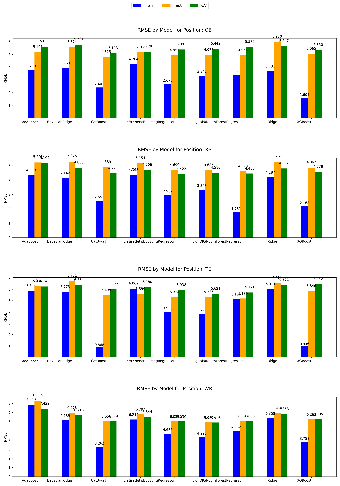
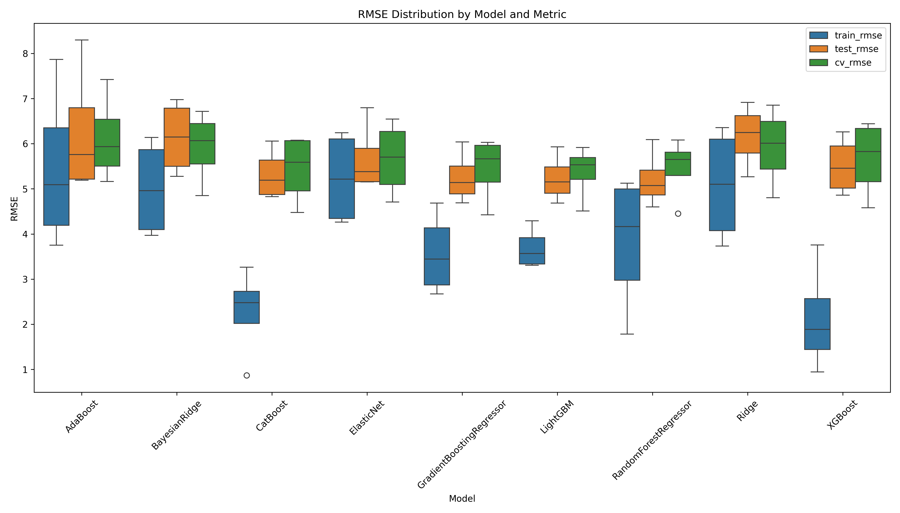

# Fantasy Football Points Prediction ML Model

Fantasy is right around the corner so I'll go ahead and open source this for others to use and contribute to. You can change what years are used for training and testing data by changing the `TRAIN_YEARS` and `TEST_YEARS` variables in the `config.py` file. It will automatically scrape the data for the years you specify and train the models.

This is a work in progress. Better features or indicators should be tried in `feature_engineering.py`. More models can be added to the `models` dictionary in `model_training.py`. The model perfomance will be outputted in the `output` folder.

## Perfomance

### RMSE by Position grouped by Model



### RSME Distribution by Model



## Models

1. **Elastic Net Regularization** - Elastic Net combines both L1 and L2 penalties of Lasso and Ridge, respectively, making it effective for handling datasets with multicollinearity and for selecting correlated features. This hybrid approach balances feature selection and regularization, reducing overfitting while retaining important predictors.

2. **Random Forest Regressor** - An ensemble learning method that constructs multiple decision trees during training and outputs the average prediction of the individual trees. Its ensemble approach enhances robustness and reduces the likelihood of overfitting, making it reliable for datasets with high variance or noise.

3. **Gradient Boosting Regressor** - This model builds an ensemble of weak learners, typically decision trees, sequentially, where each tree corrects the errors of the previous one. It is highly effective for capturing complex, non-linear relationships, often resulting in superior predictive performance on structured data.

4. **CatBoost Regressor** - A gradient boosting algorithm specifically optimized for categorical features, offering excellent performance with minimal hyperparameter tuning. Its ability to handle categorical data natively and its automatic feature combination make it particularly strong in real-world datasets with mixed data types.

5. **K-Nearest Neighbors Regressor** - A non-parametric model that predicts the target value based on the average of the nearest k neighbors in the feature space. It is intuitive and effective for capturing local patterns in the data, though its performance can degrade with high-dimensional data or noisy features.

*Each position has separate groups of models.*

New models can easily be added and compared by adding them to the models dictionary in `model_training.py/train_model()`. The perfomance will also be outputted in the results csv. New features in the data can be added by adding them in `feature_engineering.py/add_features().`

## Running the Model

To run the model, first install the required packages:

```bash
pip install -r requirements.txt
```

Then run the following command:

```bash
python main.py
```

The model will train and test on the years specified in the `config.py` file. The results will be outputed in the `output` folder. The results include graphs and information about each models perfomance on the data.

## Data

Data is dynamically scraped for input years from the nfl_data_py package. The data is then cleaned, aggregated, and transformed to be used in the models. Some of the data used is saved to file to act as a local cache in `data/`. This is also for others to use since the data is not easily accessible like college basketball data.

Feature engineer includes creating rolling averages for each stats for each player over differing timeframes (last game, 4 games, season).

Null data can be dropped, filled with mean or median easily in model_training. Default is to drop it.
