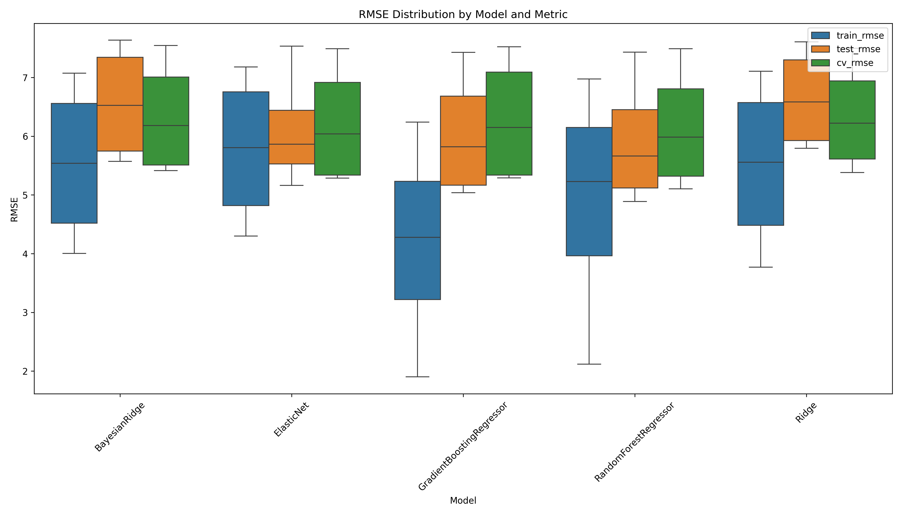
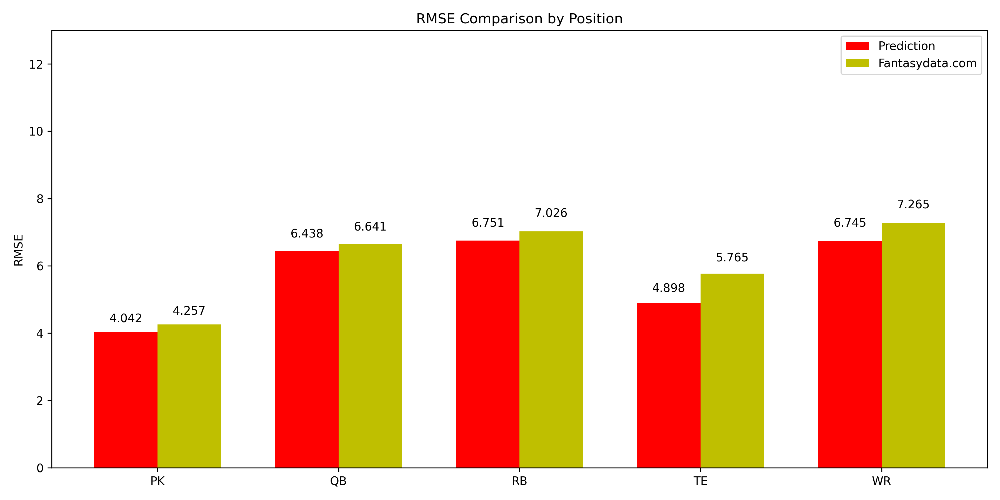

# Fantasy Football Points Prediction ML Model

Fantasy is right around the corner so I'll go ahead and open source this for others to use and contribute to. You can change what years are used for training and testing data by changing the `TRAIN_YEARS` and `TEST_YEARS` variables in the `config.py` file. It will automatically scrape the data for the years you specify and train the models.

Revival of this project: https://github.com/zzhangusf/Predicting-Fantasy-Football-Points-Using-Machine-Learning/tree/master

## Perfomance

### RMSE by Position grouped by Model

### RSME Distribution by Model

## Perfomance

### RMSE Comparison by Position

### RMSE for each Position by Model

## Models

1. **Ride Regression** - Ridge regression is similar to linear regression however it contains a penalty term which increases as the feature coefficients increase.
2. **Bayesian Ridge Regression** - Bayesian ridge regression is similar to ridge regression however it includes information about the features to determine the penalty weight.
3. **Elastic Net Regularization** - Elastic net regularization applies a weighted average of the ridge regression and lasso regression penalties. 
4. **Random Forest** - Random forest is a tree-based machine learning algorithm which splits on randomly generated selection features in an attempt to prevent over-fitting.
5. **Gradient Boosting** - Gradient Boosting is also a tree-based method which learns from previous performance mistakes. A grid search was performed to optimize the parameters within the model.

*For each algorithm, separate models were developed for each position.*

### Model Improvements

1. The linear models (Ridge Regression, Elastic Net Regularization, and Bayesian Ridge Regression) have the data scaled using the StandardScaler method from the sklearn library first due to their sensitivity to the scale of the data.
2. Use of KFold cross-validation to prevent overfitting.
3. Hyperparameter tuning using GridSearchCV to optimize the model parameters.

## Data

Data is dynamically scraped for input years from the nfl_data_py package. The data is then cleaned, aggregated, and transformed to be used in the models.
