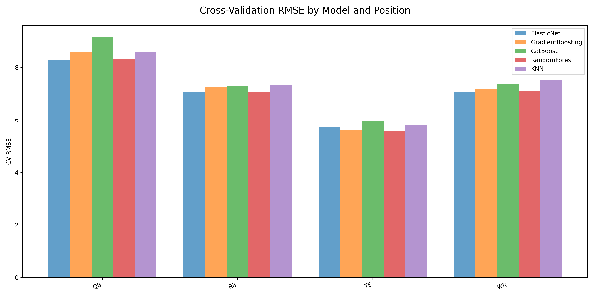
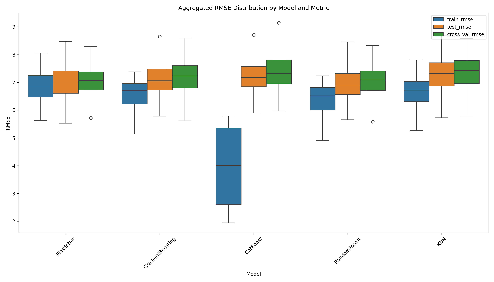

# Fantasy Football PPR Points Prediction Model

This machine learning model predicts player points in PPR (Points Per Reception) leagues using historical player performance data. The project is open-source and customizable, allowing for contributions and modifications to suit various predictive needs. A high-level overview can be found in `main.py`.

You can customize feature engineering in feature_engineering.py and modify or add new models via the models dictionary in `model_training.py`. All outputs, including model performance analysis, will be saved in the output directory.

## Performance Overview

The following results showcase the model's default performance using 2022 data for training and 2023 data for testing (predicted PPR points). You can easily modify these settings in config.py. Data for the specified years will be automatically scraped if it's not already available locally.

### Cross-Validation RMSE by Model and Position



### Aggregated RSME Distribution by Model



## Models

The following machine learning models are implemented and compared for their ability to predict fantasy football points:

1. **Elastic Net Regularization** - Combines L1 and L2 penalties (Lasso and Ridge), making it effective for handling datasets with multicollinearity. It balances feature selection and regularization, reducing overfitting while retaining important predictors.

2. **Random Forest Regressor** - An ensemble learning model that creates multiple decision trees during training. It reduces overfitting and enhances robustness, making it effective for handling noisy or high-variance datasets.

3. **Gradient Boosting Regressor** - Builds an ensemble of weak learners sequentially, with each new learner correcting errors made by previous ones. It captures complex non-linear relationships and often delivers superior performance on structured data.

4. **CatBoost Regressor** - A gradient boosting model optimized for handling categorical features. It delivers strong performance with minimal hyperparameter tuning and automatically combines features for enhanced results on mixed data types.

5. **K-Nearest Neighbors Regressor** - A non-parametric model that predicts the target value based on the average of the nearest k neighbors. It effectively captures local patterns but may struggle with high-dimensional or noisy data.

*Each position group (e.g., QB, RB, WR) has its own set of models for prediction.*

New models can be easily added by updating the models dictionary in `model_training.py`. The performance of any new models will automatically be included in the results CSV and visualized accordingly. Additionally, new features can be incorporated into the dataset by modifying `feature_engineering.py`.

## How to Run the Model

1. Install required packages (virtual environment recommended):

    ```bash
    pip install -r requirements.txt
    ```

2. Run the model:

    ```bash
    python main.py
    ```

The model will train and test using the years specified in the `config.py` file. Output, including performance results, graphs, and trained models, will be saved in the output directory with a timestamp.

Sample output is provided in the output folder, except for the trained models, which are omitted due to file size constraints.

## Model Validation

The model is validated using 5-fold cross-validation. RMSE (Root Mean Square Error) is calculated for each fold and averaged to assess the model’s performance. This cross-validation RMSE is then compared across models to identify the best-performing model.

RMSE is a measure of prediction accuracy, calculated by taking the square root of the average squared differences between the predicted and actual values.

## Data Collection and Feature Engineering

Data is dynamically scraped for the specified years using the nfl_data_py package. The data is cleaned, aggregated, and transformed for use in the models. Scraped data is cached locally in the `data/` directory for future use, enabling faster re-runs without additional scraping.

### Feature Engineering

Key features are engineered by generating rolling averages for various player statistics (e.g., over the last game, last 4 games, or season). You can modify or extend the feature engineering process in `feature_engineering.py`.

### Handling Missing Data

Missing values are imputed with zeros by default, but this behavior can be customized in `model_training.py`.
