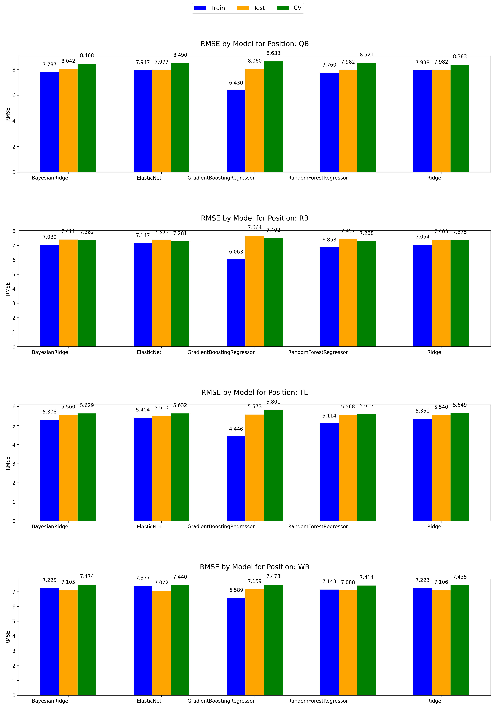

# Fantasy Football Points Prediction ML Model

Revival of this project: https://github.com/zzhangusf/Predicting-Fantasy-Football-Points-Using-Machine-Learning/tree/master

Future goals include integration with data scraping and frontend application.

## Perfomance

### RMSE by Position grouped by Model

## Models

1. **Ride Regression** - Ridge regression is similar to linear regression however it contains a penalty term which increases as the feature coefficients increase.
2. **Bayesian Ridge Regression** - Bayesian ridge regression is similar to ridge regression however it includes information about the features to determine the penalty weight.
3. **Elastic Net Regularization** - Elastic net regularization applies a weighted average of the ridge regression and lasso regression penalties. 
4. **Random Forest** - Random forest is a tree-based machine learning algorithm which splits on randomly generated selection features in an attempt to prevent over-fitting.
5. **Gradient Boosting** - Gradient Boosting is also a tree-based method which learns from previous performance mistakes. A grid search was performed to optimize the parameters within the model.

### Model Improvements

1. The Ridge Regression and Elastic Net Regularization models have the data scaled using the StandardScaler method from the sklearn library first due to their sensitivity to the scale of the data.

*For each algorithm, separate models were developed for each position.*

## Data

Data currently is sourced from the original project. It includes 2015 and 2016. 
TODO: Add data from 2017-2020